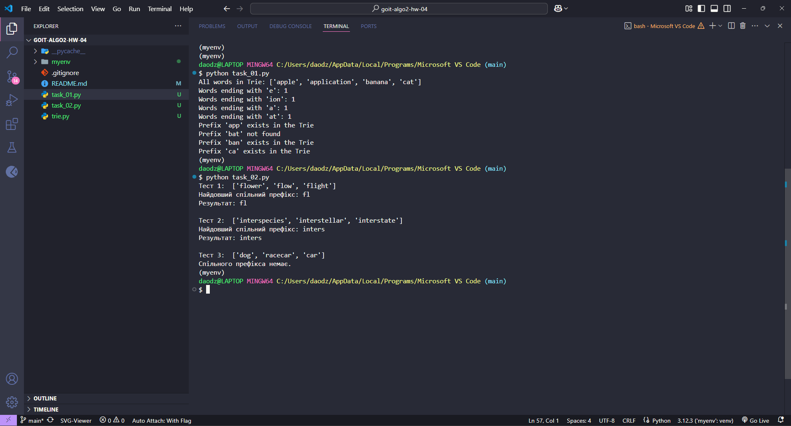

# Homework Assignment on "Prefix Trees"

Welcome to the homework on "Prefix Trees"! 🙂

This homework consists of two independent tasks.

By diving into working with prefix trees through these practical tasks, you will uncover a powerful tool for text data processing. By extending the functionality of the Trie tree, you won’t just learn theory but also understand how this data structure helps solve real-world text search and analysis problems.

By implementing methods for working with suffixes and prefixes, you will see how modern autocomplete and spell-checking systems work. Additionally, the task of finding the longest common prefix will teach you how to optimize algorithms considering both speed and memory usage.

Experience with prefix trees will serve as a solid foundation for studying more complex algorithms and data structures, especially if you plan to work with natural language processing or search engines.

This is not just a learning exercise—it's your step towards understanding how modern text processing systems, which we use daily, are created.

### Solution



## Task 1. Extending the Functionality of the Prefix Tree

Implement two additional methods for the Trie class:

- `count_words_with_suffix(pattern)` to count the number of words ending with the given pattern.
- `has_prefix(prefix)` to check for the existence of words with the given prefix.

### Technical Requirements:

- The `Homework` class must inherit from the base `Trie` class.
- The methods should handle invalid input errors.
- The input parameters of both methods must be strings.
- The `count_words_with_suffix` method should return an integer.
- The `has_prefix` method should return a boolean value.

### Acceptance Criteria:

📌 The acceptance criteria are mandatory for the mentor to review the task. If any of the criteria are not met, the mentor will return the homework for revision without grading. If you just need "clarification"😉 or get stuck on any of the steps, feel free to reach out to the mentor via Slack.

1. The `count_words_with_suffix` method returns the number of words ending with the given pattern. If no words are found, it returns 0. It is case-sensitive (10 points).
2. The `has_prefix` method returns True if there is at least one word with the given prefix. It returns False if no such words exist. It is case-sensitive (10 points).
3. The code passes all tests (10 points).
4. Invalid input data is handled (10 points).
5. The methods work efficiently on large datasets (10 points).

### Program Template:

```python
from trie import Trie

class Homework(Trie):
    def count_words_with_suffix(self, pattern) -> int:
        pass

    def has_prefix(self, prefix) -> bool:
       pass

if __name__ == "__main__":
    trie = Homework()
    words = ["apple", "application", "banana", "cat"]
    for i, word in enumerate(words):
        trie.put(word, i)

    # Check the number of words ending with the given suffix
    assert trie.count_words_with_suffix("e") == 1  # apple
    assert trie.count_words_with_suffix("ion") == 1  # application
    assert trie.count_words_with_suffix("a") == 1  # banana
    assert trie.count_words_with_suffix("at") == 1  # cat

    # Check for the existence of a prefix
    assert trie.has_prefix("app") == True  # apple, application
    assert trie.has_prefix("bat") == False
    assert trie.has_prefix("ban") == True  # banana
    assert trie.has_prefix("ca") == True  # cat

```

***

## Task 2. Finding the Longest Common Prefix

Create a class `LongestCommonWord` that inherits from the `Trie` class and implement the method `find_longest_common_word` that finds the longest common prefix for all words in the input array of strings `strings`.

### Technical Requirements:

- The `LongestCommonWord` class must inherit from `Trie`.
- The input parameter for the `find_longest_common_word` method, `strings`, is an array of strings.
- The `find_longest_common_word` method must return a string—the longest common prefix.
- Time complexity:  *O(S)*, where *S* is the total length of all strings.

### Acceptance Criteria:

1. The `find_longest_common_word` method:
  - Returns the longest common prefix shared by all words (10 points).
  - Returns an empty string if there is no common prefix (10 points).
  - Correctly handles an empty array or invalid input data (10 points).

2. The code passes all tests (20 points).

### Program Template:

```python

from trie import Trie

class LongestCommonWord(Trie):

    def find_longest_common_word(self, strings) -> str:
        pass

if __name__ == "__main__":
    # Tests
    trie = LongestCommonWord()
    strings = ["flower", "flow", "flight"]
    assert trie.find_longest_common_word(strings) == "fl"

    trie = LongestCommonWord()
    strings = ["interspecies", "interstellar", "interstate"]
    assert trie.find_longest_common_word(strings) == "inters"

    trie = LongestCommonWord()
    strings = ["dog", "racecar", "car"]
    assert trie.find_longest_common_word(strings) == ""

```
